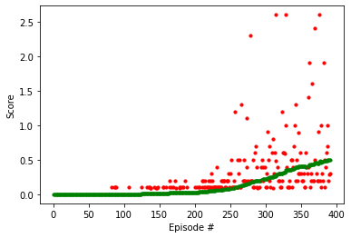
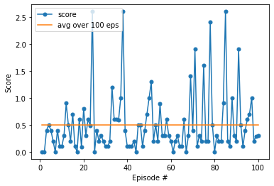

# Deep RL and Tennis: Analysis of results

## Learning Environment

In this environment, two agents control rackets to bounce a ball over a net. If an agent hits the ball over the net, it receives a reward of +0.1. If an agent lets a ball hit the ground or hits the ball out of bounds, it receives a reward of -0.01. Thus, the goal of each agent is to keep the ball in play.

The observation space consists of 8 variables corresponding to the position and velocity of the ball and racket. Each agent receives its own, local observation. Two continuous actions are available, corresponding to movement toward (or away from) the net, and jumping.

The task is episodic, and in order to solve the environment, the agents must get an average score of +0.5 (over 100 consecutive episodes, after taking the maximum over both agents).

The environment is considered solved, when the average (over 100 episodes) of those scores is at least +0.5.


## Agent

Traditional reinforcement learning approaches such as Q-Learning or policy gradient are poorly suited to multi-agent environments due to the environment becoming non-stationary from the perspective of any individual agent. This means that the environment changes in a way that is not explainable by changes in the agent’s own policy, leading to learning instability.

To solve this environment, this work uses the approach proposed in [Lowe et al, Multi-Agent Actor-Critic for Mixed Cooperative-Competitive Environments](https://arxiv.org/pdf/1706.02275.pdf), and adopts a centralized training with decentralized execution, allowing the policies to use extra information to ease training, as long as this information is not used at test time.
To do this, following [Lowe et al, Multi-Agent Actor-Critic for Mixed Cooperative-Competitive Environments](https://arxiv.org/pdf/1706.02275.pdf), this work implements a simple extension to the actor-critic policy gradient method, where the critic is augmented with extra information about the policies of other agents, while the actor only has access to local information. After training is completed, only the local actors are used at execution phase, acting in a decentralized manner and equally applicable in cooperative and competitive settings.


In this implementation, the actor network is implemented through a simple network:

```
self.fc1 = nn.Linear(state_size, fc1)
self.fc2 = nn.Linear(fc1, fc2)
self.fc3 = nn.Linear(fc2, action_size)
```

where state_size=24 (Each observes a state with length 24), fc1=512, fc2=256, action_size=2.
Each linear layer is followed by a `ReLU` activation function, except for the last one which uses a `tanh` to constrain the action values to the correct range.
Each agent implements its own Actor network.

The Critic network in this implementation uses the same architecture, except for the last linear layer that has no non-linear activation after it and is used to directly output the q-values.
Both agents use the same global Critic network.

A replay buffer is used to stabilise training. Each agent waits for the buffer to contain at least `BATCH_SIZE` experiences before learning. Once learning starts, a single learning update is done at every timestep.

## Hyperparameters

```
BUFFER_SIZE = int(1e6)  # replay buffer size
BATCH_SIZE = 128        # minibatch size
GAMMA = 0.99            # discount factor
TAU = 2e-1              # for soft update of target parameters
LR_ACTOR = 1e-4         # learning rate of the actor
LR_CRITIC = 3e-4        # learning rate of the critic
WEIGHT_DECAY = 0        # L2 weight decay
```


## Results

The environment is solved in 391 episodes, with an average score of 0.5 over 100 episodes.

The picture below reports the scores (only those >0) obtained per episode (in red) and the rolling average over the last 100 episodes.


The last 100 episodes are reported in the picture below:




## Future Work

Implementing a prioritized experience replay can improve stability making it possible to train with less episodes. Not much hyperparameter tuning has been done. There is certainly some work that can be done here to improve it.
Alternative methods to MADDPG could be implemented and their performance compared.
For example, comparing results with DDPG using a critic per agent could be interesting.
Alternatives, such as [Proximal Policy Optimization (PPO)](https://openai.com/blog/openai-baselines-ppo/#ppo), which strikes a balance between ease of implementation, sample complexity, and ease of tuning, could also be used.
